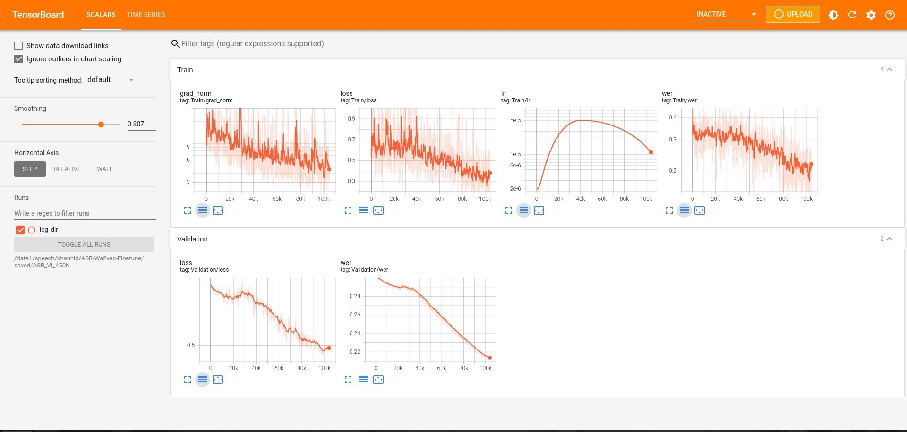

# :zap: TINH CHỈNH Wav2Vec 2.0 CHO NHẬN DIỆN GIỌNG NÓI
### Mục lục
1. [Tài liệu](#tài-liệu)
2. [Các Tính Năng Có Sẵn](#tính-năng)
3. [Cài Đặt](#cài-đặt)
4. [Huấn Luyện](#huấn-luyện)
5. [Dự Đoán](#dự-đoán)
6. [Nhật Ký và Trực Quan Hóa](#nhật-ký)

<a name="tài-liệu"></a>
### Tài Liệu
Giả sử bạn cần một cách đơn giản để tinh chỉnh mô hình Wav2vec 2.0 cho nhiệm vụ Nhận Diện Giọng Nói trên bộ dữ liệu của bạn, bạn đến đúng nơi rồi đấy.
</br>
Tất cả tài liệu liên quan đến dự án này có thể được tìm thấy tại đây:
- [Wav2vec2ForCTC](https://huggingface.co/docs/transformers/model_doc/wav2vec2#transformers.Wav2Vec2ForCTC)
- [Hướng Dẫn](https://huggingface.co/blog/fine-tune-wav2vec2-english)

<a name="tính-năng"></a>
### Các Tính Năng Có Sẵn
- [x] Huấn luyện trên nhiều GPU
- [x] Tự động Mix Precision
- [ ] Đẩy lên Huggingface Hub

<a name="cài-đặt"></a>
### Cài Đặt
```
pip install -r requirements.txt
```

<a name="huấn-luyện"></a>
### Huấn Luyện
1. Chuẩn bị bộ dữ liệu của bạn
    - Bộ dữ liệu của bạn có thể ở định dạng <b>.txt</b> hoặc <b>.csv</b>.
    - Các cột <b>path</b> và <b>transcript</b> là bắt buộc. Cột <b>path</b> chứa đường dẫn đến các tệp âm thanh của bạn, tùy thuộc vào vị trí bộ dữ liệu của bạn, có thể là đường dẫn tuyệt đối hoặc đường dẫn tương đối. Cột <b>transcript</b> chứa bản ghi tương ứng với đường dẫn âm thanh. 
    - Kiểm tra các [tệp mẫu](examples/train_data_examples/) của chúng tôi để biết thêm thông tin.
    * <b>Quan trọng:</b> Bỏ qua các ghi chú sau vẫn ổn nhưng có thể ảnh hưởng đến hiệu suất.
        - <strong>Đảm bảo bản ghi của bạn chỉ chứa các từ</strong>. Số nên được chuyển đổi thành từ và các ký tự đặc biệt như ```r'[,?.!\-;:"“%\'�]'``` được loại bỏ mặc định, nhưng bạn có thể thay đổi chúng trong [base_dataset.py](base/base_dataset.py) nếu bản ghi của bạn không đủ sạch. 
        - Nếu bản ghi của bạn chứa các biểu tượng đặc biệt như ```bos_token, eos_token, unk_token (ví dụ: <unk>, [unk],...) hoặc pad_token (ví dụ: <pad>, [pad],...))```. Vui lòng chỉ định chúng trong tệp [config.toml](config.toml) hoặc Tokenizer sẽ không thể nhận diện chúng.
2. Cấu hình tệp [config.toml](config.toml): Chú ý đến đối số <b>pretrained_path</b>, nó tải mô hình được đào tạo trước "facebook/wav2vec2-base" từ Facebook theo mặc định. Thay đổi nó thành các mô hình được đào tạo từ giai đoạn 1 nếu cần thiết.
3. Chạy
    - Bắt đầu huấn luyện từ đầu:
        ```
        python train.py -c config.toml
        ```
    - Tiếp tục:
        ```
        python train.py -c config.toml -r
        ```
    - Tải mô hình cụ thể và bắt đầu huấn luyện:
        ```
        python train.py -c config.toml -p path/to/your/model.tar
        ```

<a name="dự-đoán"></a>
### Dự Đoán
Chúng tôi cung cấp một tập lệnh dự đoán có thể chuyển đổi một tệp âm thanh cụ thể hoặc thậm chí là một danh sách các tệp âm thanh. Hãy xem xét các đối số dưới đây, đặc biệt là đối số ```-f TEST_FILEPATH``` và đối số ```-s HUGGINGFACE_FOLDER```:
```cmd
sử dụng: inference.py [-h] -f TEST_FILEPATH [-s HUGGINGFACE_FOLDER] [-m MODEL_PATH] [-d DEVICE_ID]

CÁC ĐỐI SỐ DỰ ĐOÁN ASR

tuỳ chọn đối số:
  -h, --help            Hiển thị trợ giúp này và thoát
  -f TEST_FILEPATH, --test_filepath TEST_FILEPATH
                        Có thể là đường dẫn đến tệp âm thanh của bạn (.wav, .mp3) hoặc một tệp văn bản (.txt) chứa danh sách các đường dẫn tệp âm thanh.
  -s HUGGINGFACE_FOLDER, --huggingface_folder HUGGINGFACE_FOLDER
                        Thư mục bạn lưu trữ các tệp huggingface. Kiểm tra đối số <local_dir> của [huggingface.args] trong config.toml. Giá trị mặc định: "huggingface-hub".
  -m MODEL_PATH, --model_path MODEL_PATH
                        Đường dẫn đến mô hình (.tar file) trong saved/<project_name>/checkpoints. Nếu không được cung cấp, mặc định sử dụng pytorch_model.bin trong <HUGGINGFACE_FOLDER>
  -d DEVICE_ID, --device_id DEVICE_ID
                        Thiết bị bạn muốn kiểm tra mô hình của mình trên nếu CUDA có sẵn. Nếu không, sử dụng CPU. Giá trị mặc định: 0

Chuyển văn bản từ một tệp âm thanh:
```cmd
python inference.py \
    -f path/to/your/audio/file.wav(.mp3) \
    -s huggingface-hub

# output example:
>>> transcript: Hello World 
```

Chuyển văn bản từ một danh sách các tệp âm thanh. Kiểm tra tệp đầu vào test.txt và tệp đầu ra transcript_test.txt (sẽ được lưu trong cùng một thư mục với tệp đầu vào):

```cmd
python inference.py \
    -f path/to/your/test.txt \
    -s huggingface-hub
```

<a name="nhật-ký"></a>

### Nhật Ký và Trực Quan Hóa
Các nhật ký trong quá trình huấn luyện sẽ được lưu trữ và bạn có thể xem nó bằng TensorBoard bằng cách chạy lệnh này:
```
# specify the <project_name> in config.json
tensorboard --logdir ~/saved/<project_name>

# specify a port 8080
tensorboard --logdir ~/saved/<project_name> --port 8080
```
